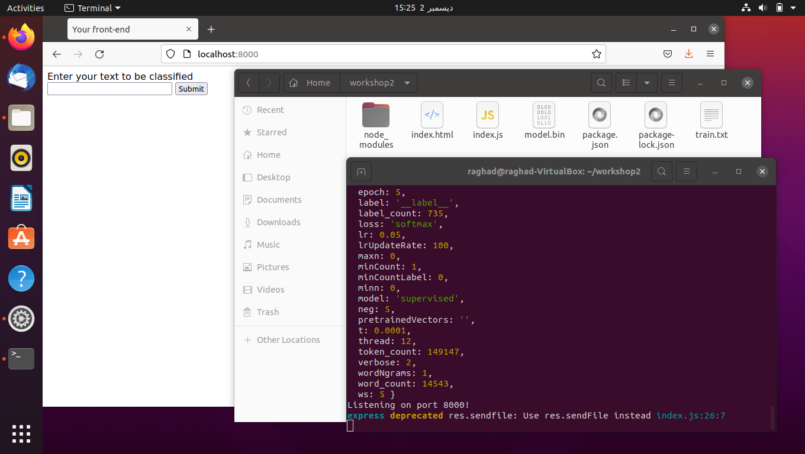
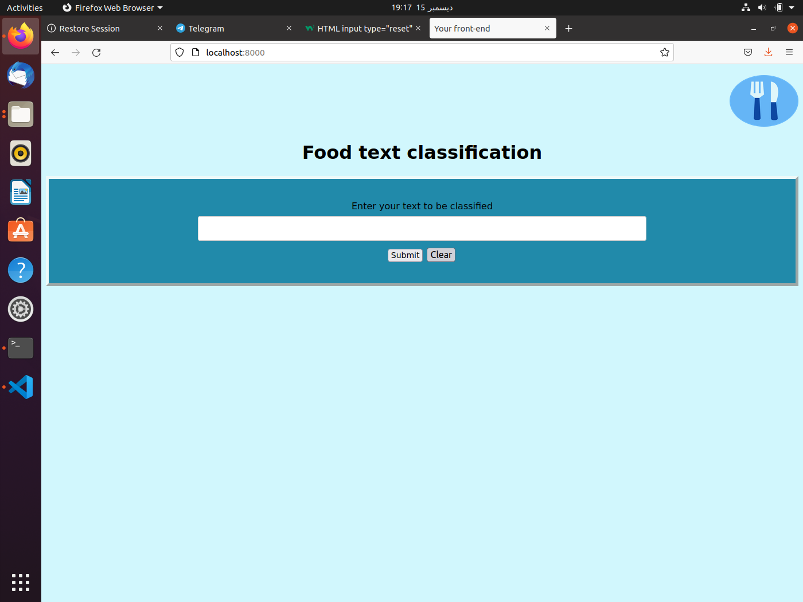
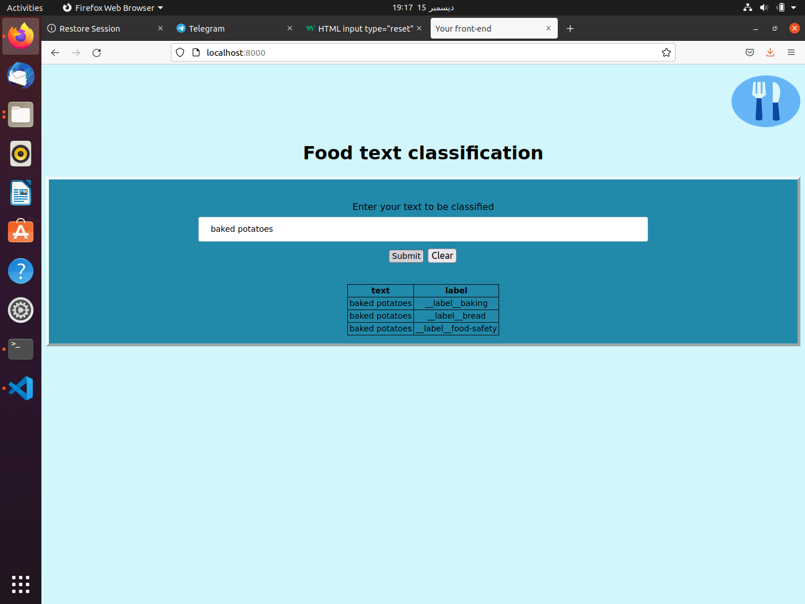
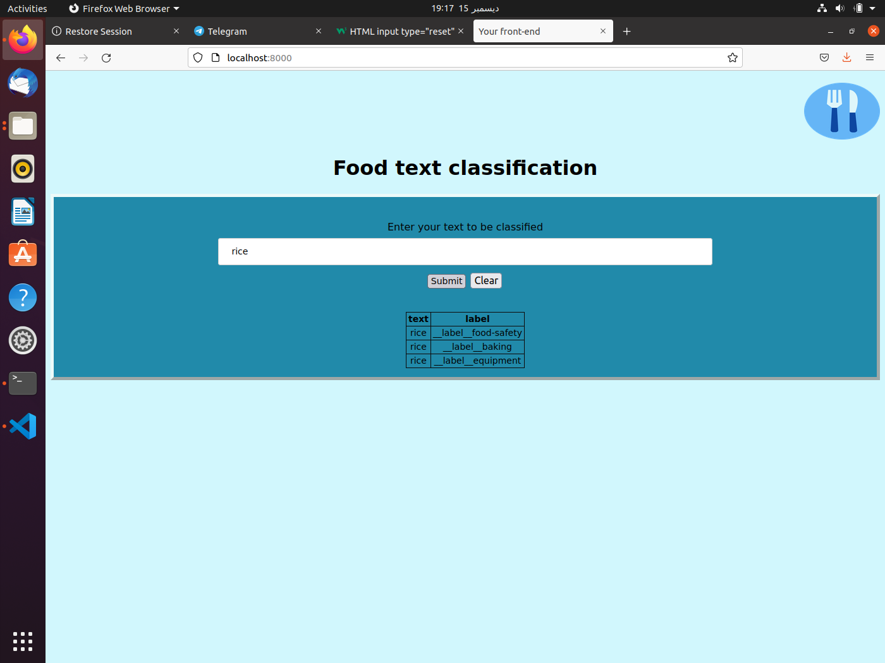

# Workshop (devloping food text classification system )
# Web-Based Machine Learning System
---

This is a project required for a Software Engineering2 course.<br>
It is done as teamwork by Alhanouf Almansour and Kholod Alnufaie and Raghad Albosais.

---
## Table of content
- Project overview
- Development environment requirements
- How to install
- How to use
- Travis ci intergration 
- Releases
- Contributors
---

### Project overview
The purpose of the project is to gain a knowledge of currently challenges of software engineering activities and the skills to apply them.  <br>
The project is divided into two take, the first task is to run the first version of a developed web-based machine learning system for simple text classification (form this repo in GitHub) and create a repo, put in it the code after completing the run, create the tag, and put the first release in the repo.<br>
The second task we will integrate and run Travis CI in this repo, and update the user interface page. It will be done on 9/12/2021.

---

### Development environment requirements
- VM 
- Ubuntu OS in VM

---

### How to install

Download the three files (index.html, index.js, and train.txt) in your ubuntu environment.
Next, follow the steps below to set up a Node js server to run the core system of the machine learning (fasttext tool for text classification) on input from a user.
1. Download npm: 
```
sudo apt install npm 
```
2. Create and open project folder:
```
mkdir [your choice name] 
```
3. Initialize requirements: 
```
npm init -y 
```
4. Add index.html,index.js and train.txt in the same folder. [check the supplement materials] 
5. Install the Node.js sandbox for the Machine learning algorithm (fasttext): 
```
npm install nodefasttext --save 
```
6. Install Express: 
```
npm install express --save 
```
7. Install some cors issues: 
```
npm install cors --save 
```
8. Now if you want to get this sandbox up and running pretty quick you go ahead and use my HTML and J's files (provided on this URL) and once you have done. 
9. Run index.js: 
```
node index.js
```
---

### How to use
After you install it, the result of the last command will provide to your localhost port number, open it in your browser by typing “localhost:8000” and HTML page showen below will appear accordingly.<br><br>


Next, you can type text to be classified and test if its success, for example, type ”baked potatoes”. <br><br>


The result on HTML page appears "success" and in the terminal illustrates all possible labels for that text.<br><br>
<br><br>


---
### travis integration 
[](https://app.travis-ci.com/hkh7897/Workshop2)

____ 
step :<br>
1- log in in travic ci with github account <br>
2- active the repository [workshop2] in travic<br>
3- puch travic.yml file in repository <br>
____
issue :<br>
it was show erro for every branch and dose not accept the changes and build.<br>
i modify the package.json file in repository by exchange this part.<br>
 "test": "echo \"Error: no test specified\" && exit 1 <br>
 with <br>
   "test": "echo \"No test specified\"" <br>
____

### Releases
 first release  <br>
The first release with tag V0.0.0 is created with the same code we have run it.
_______________________________________________________________________________
second release  <br>
update the GUI <br>
<br><br>
The second release with tag V0.1.0 is created with the new code i update the GUI to have tow additional feature. <br>
1- clear button to clear the entered text and let the user able to change/update <br>
the text before sending it the server.<br>
<br><br>
<br><br>

2- Submit button shall be responsible to wrap the text and send it to the server <br>
<br><br>
<br><br>

---


 

### Contributors 

Made with [raghad albosais](https://github.com/RaghadKhaled) and [Alhanouf Almansour](https://github.com/AlhanoufAlmans)
